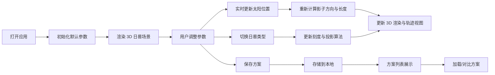

## 1. 产品概述

日晷模拟器是一款基于 Web 的交互式教育工具，通过 3D 可视化技术展示不同纬度、日期和时间下日晷影子的方向与长度变化。用户可以切换多种日晷类型，调整参数观察影子变化，并保存多个方案进行对比学习。

- 核心价值：将抽象的天文概念具象化，帮助用户理解日晷原理与太阳运行规律
- 目标用户：天文爱好者、学生、教师以及对时间测量历史感兴趣的人群

## 2. 核心功能

### 2.1 功能模块

1. **3D 日晷视图**：可旋转交互的三维日晷模型，实时显示影子
2. **参数控制面板**：日期时间选择器、纬度滑块、日晷类型切换
3. **影子轨迹视图**：展示一天内影子端点的运动轨迹
4. **方案管理**：保存、加载、对比多组参数配置

### 2.2 页面详情

| 页面名称 | 模块名称 | 功能描述 |
|---------|---------|---------|
| 首页 | 3D 日晷视图 | 可拖拽旋转、缩放的 Three.js 场景，包含日晷本体、指针、实时影子 |
| 首页 | 参数控制面板 | 日期选择、时间滑块、纬度输入(-90°~90°)、日晷类型切换(赤道式/水平式/垂直式) |
| 首页 | 影子轨迹视图 | 2D 俯视图展示一天中影子端点的轨迹曲线 |
| 首页 | 方案管理器 | 保存当前参数方案、方案列表、加载/删除方案、对比模式 |

## 3. 核心流程

用户打开应用 → 默认显示当前时间地点的水平式日晷 → 调整纬度/日期/时间参数 → 观察影子实时变化 → 切换日晷类型查看不同刻度 → 保存感兴趣的参数方案 → 在轨迹视图中对比一天的影子变化

## 4. 用户界面设计

### 4.1 设计风格

- **设计主题**：科技复古风格，融合天文观测的精密感与古典日晷的美学
- **主色调**：深靛蓝 (#0f172a) 作为背景主色，营造夜空/深邃感
- **辅助色**：暖金色 (#f59e0b) 代表太阳与光影，铜棕色 (#92400e) 代表日晷材质
- **点缀色**：青蓝色 (#38bdf8) 用于交互元素与数据高亮
- **字体**：标题使用 Cinzel（古典衬线），正文使用 Inter（现代无衬线）
- **卡片风格**：半透明玻璃态卡片，带微妙边框与柔和阴影
- **按钮风格**：圆角中等，悬停有轻微上浮与发光效果

### 4.2 页面布局

整体采用三栏式布局：
- 左侧：参数控制面板（固定宽度，可折叠）
- 中央：3D 日晷主视图（自适应区域）
- 右侧：影子轨迹 + 方案管理（固定宽度，上下分布）

| 页面名称 | 模块名称 | UI 元素 |
|---------|---------|---------|
| 首页 | 3D 日晷视图 | Three.js 画布、轨道控制器、环境光、方向光模拟太阳、地面阴影接收 |
| 首页 | 参数控制面板 | 分段控件(日晷类型)、日期选择器、时间滑块带刻度、数字输入框(纬度)、实时显示太阳高度/方位角 |
| 首页 | 影子轨迹视图 | SVG 画布、方位坐标系、轨迹曲线、当前时刻标记 |
| 首页 | 方案管理器 | 卡片列表、保存按钮、删除按钮、对比模式开关 |

### 4.3 响应式

桌面端优先设计，支持中等屏幕自适应。
- 平板：左右面板转为上下堆叠，中央视图保留
- 移动端：采用标签页切换，3D 视图全屏展示

### 4.4 3D 场景指引

- **环境**：深蓝渐变天空盒 + 柔和雾效，营造宇宙空间感
- **光照**：单方向光模拟太阳（随时间变化位置与强度），配合环境光补充暗部
- **相机**：透视相机，初始 45° 俯视角，支持 OrbitControls 拖拽旋转缩放
- **材质**：日晷盘面使用金属质感材质，刻度使用自发光材质，指针使用深色金属
- **动画**：参数变化时影子与太阳位置平滑过渡（0.3s 缓动）
- **性能**：单一场景，几何面数控制在 5k 以内，确保 60fps
