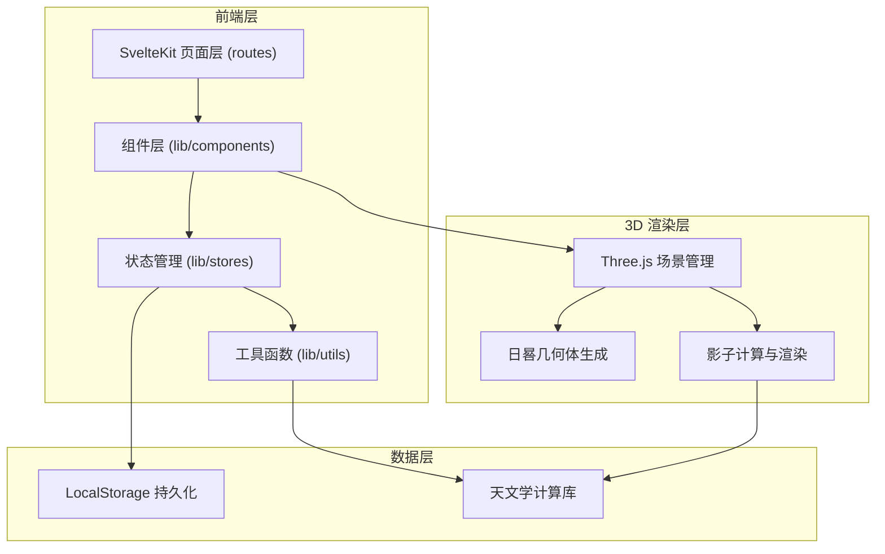

## 1. 架构设计



## 2. 技术描述

- **前端框架**：SvelteKit 2.x + TypeScript 5.x
- **构建工具**：Vite 5.x（SvelteKit 内置）
- **3D 渲染**：Three.js 0.160+
- **UI 组件库**：Skeleton UI 2.x（基于 Tailwind CSS）
- **样式方案**：Tailwind CSS 3.x + 自定义 CSS 变量
- **状态管理**：Svelte Stores（内置响应式状态）
- **数据持久化**：LocalStorage（保存用户方案）
- **图标**：Lucide Svelte

## 3. 目录结构

```
src/
├── routes/
│   └── +page.svelte          # 首页（主应用）
├── lib/
│   ├── components/
│   │   ├── SundialScene.svelte    # 3D 日晷场景组件
│   │   ├── ControlPanel.svelte    # 参数控制面板
│   │   ├── ShadowTrack.svelte     # 影子轨迹视图
│   │   └── PresetManager.svelte   # 方案管理器
│   ├── stores/
│   │   └── sundialStore.ts        # 全局状态管理
│   ├── utils/
│   │   ├── astronomy.ts           # 天文学计算（太阳位置）
│   │   └── sundialMath.ts         # 日晷投影算法
│   └── types/
│       └── index.ts               # TypeScript 类型定义
├── app.html
└── app.css
```

## 4. 核心模块说明

### 4.1 天文学计算模块 (astronomy.ts)

| 函数 | 说明 |
|------|------|
| `getSolarPosition(date, latitude, longitude)` | 计算太阳高度角和方位角 |
| `getSunriseSunset(date, latitude)` | 计算日出日落时间 |
| `isSunVisible(date, latitude)` | 判断太阳是否在地平线以上 |
| `getDayLength(date, latitude)` | 计算日照时长 |

### 4.2 日晷数学模块 (sundialMath.ts)

| 函数 | 说明 |
|------|------|
| `getEquatorialShadow(solarPos, gnomonLength)` | 赤道式日晷影子计算 |
| `getHorizontalShadow(solarPos, latitude, gnomonLength)` | 水平式日晷影子计算 |
| `getVerticalShadow(solarPos, latitude, gnomonLength)` | 垂直式日晷影子计算 |
| `getShadowTrackPoints(type, date, latitude, gnomonLength)` | 获取一天内影子轨迹点集 |

### 4.3 状态管理 (sundialStore.ts)

```typescript
interface SundialState {
  type: 'equatorial' | 'horizontal' | 'vertical';
  latitude: number;        // -90 ~ 90
  date: Date;              // 当前日期
  timeHours: number;       // 0 ~ 24
  gnomonLength: number;    // 指针长度
  presets: Preset[];       // 保存的方案
  showTrack: boolean;      // 是否显示轨迹
}

interface Preset {
  id: string;
  name: string;
  type: SundialType;
  latitude: number;
  date: string;
  timeHours: number;
  createdAt: number;
}
```

## 5. 日晷类型说明

| 类型 | 特点 | 刻度排列 | 适用场景 |
|------|------|----------|----------|
| 赤道式 | 盘面平行于赤道面，指针指向北极星 | 均匀刻度，全年一致 | 中低纬度地区 |
| 水平式 | 盘面水平放置于地面 | 非均匀刻度，随纬度变化 | 最常见的日晷形式 |
| 垂直式 | 盘面垂直于地面（南向墙面） | 非均匀刻度，上下午对称 | 建筑墙面安装 |

## 6. 数据持久化

使用 LocalStorage 存储用户方案，Key 为 `sundial-presets`，值为 JSON 数组。
- 最大保存数量：20 个
- 数据格式：`Preset[]`
- 自动加载：应用启动时从 LocalStorage 读取
